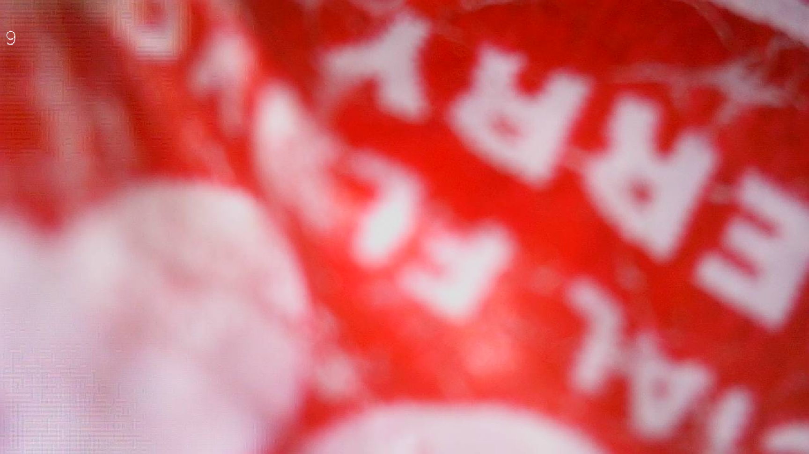

# TIMESISO-H100-Wireless-Intelligent-Visual-Blackhead-Remover-Vacuum-Hacks

TIMESISO-H100-Wireless-Intelligent-Visual-Blackhead-Remover-Vacuum-Hacks documents my attempt at reverse engineering TIMESISO's H100 Wireless "Intelligent" Visual Blackhead Remover Vacuum.

## Network Inspection

## Packet Analysis

**Commands**
All commands are prepended with `0xeeffeeff`. Below is a table of the currently known commands found through the fuzzing process.

| Command | Command Response (ASCII) | Description |
| --- | --- | --- |
| `0x01` | N/A | Unknown |
| `0x02` | N/A | Unknown |
| `0x03` | N/A | Unknown (Possibly Error/Null Command?) |
| `0x04` | îÿîÿ5YPCJL-WiFi-Camera4.000.002HW-JL-WIFI-V1.0 | Camera/Wifi Device IDs? |
| `0x05` | îÿîÿCTimesiso-h2015 ... 12345678 | Pore Vacuum Wifi Network SSID and Password |
| `0x06` | N/A | Unknown (Possibly Error/Null Command?) |
| `0x07` | N/A | Unknown |
| `0x08` | N/A | Unknown (Possibly Error/Null Command?) |
| `0x09` | N/A | Unknown (Possibly Error/Null Command?) |
| `0x0a` | N/A | (Start Receving Video Command?) Triggers JPEG/JFIF encoded frames of the camera video feed to be sent over TCP |
| `0x0b` | N/A | Unknown |
| `0x0c` | N/A | Unknown (Possibly Error/Null Command?) |
| `0x0d` | N/A | Unknown (Possibly Error/Null Command?) |
| ... | ... | ... |
| `0xff` | N/A | Unknown (Possibly Error/Null Command?) |

## Physical Disassembly

## Mobile App Analysis

## Provided Scripts

**Displaying video from the Pore Vacuum**

This script issues a "start receiving video" command and reads in the JPEG/JFIF encoded frames of the video feed over TCP. The pore vacuum video feed can lag, freeze and timeout especially when the Pore Vacuum is low on battery.

```shell
Usage: python3 display_pore_vacuum_video.py <pore_vacuum_ip>
```




`
